# 🏥MediSched AI
MediSched AI is an advanced, end-to-end healthcare orchestration portal designed to bridge operational overhead thresholds seamlessly. By merging intuitive administrative control panels with real-time backend automation, MediSched AI optimizes patient workflow protocols, streamlines clinical outbound communication pipelines and integrates localized data streams effectively.

## 🌌 Quick Glance
<p align="center">
  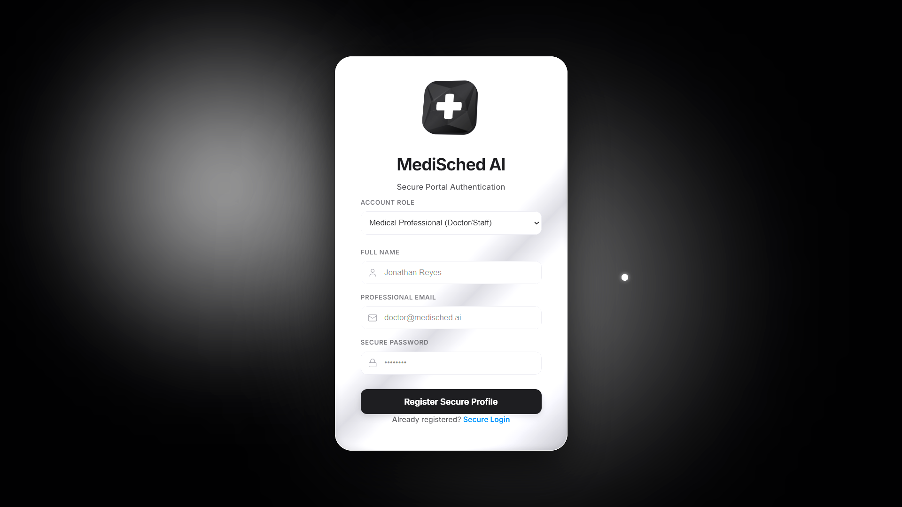<br>
  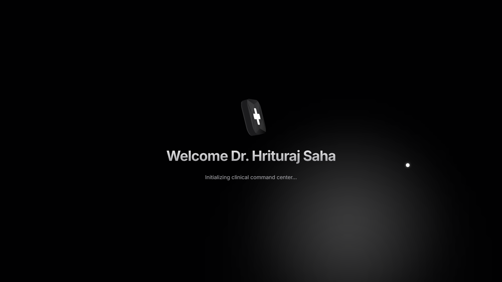<br>
  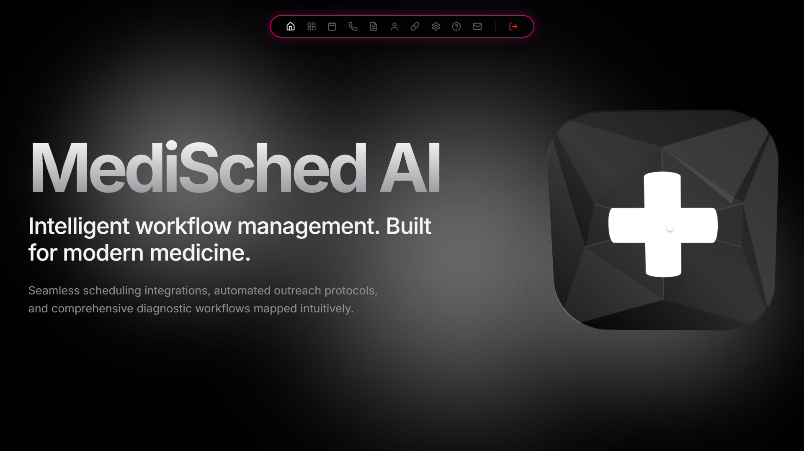<br>
  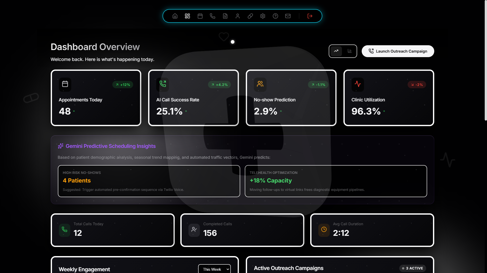<br>
  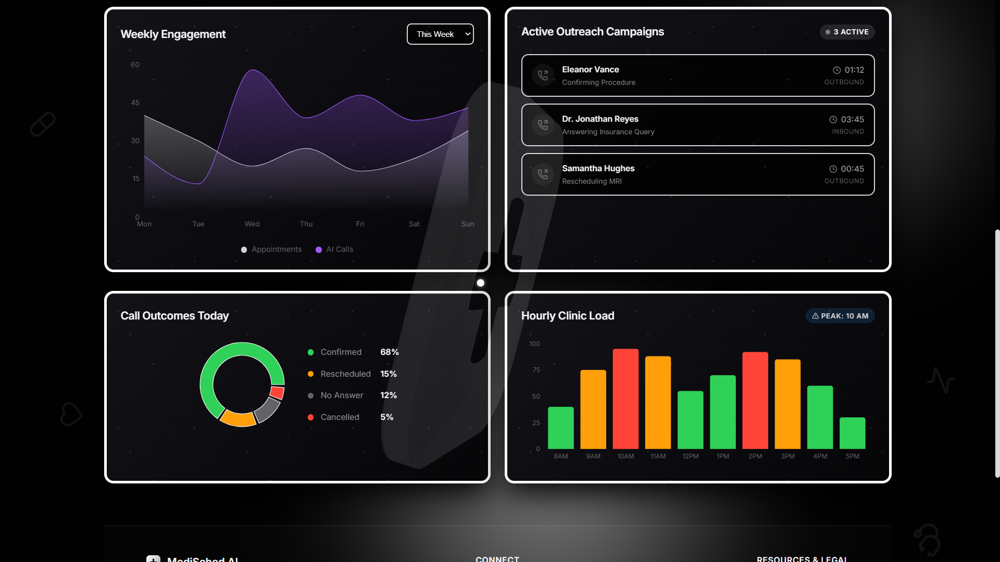<br>
  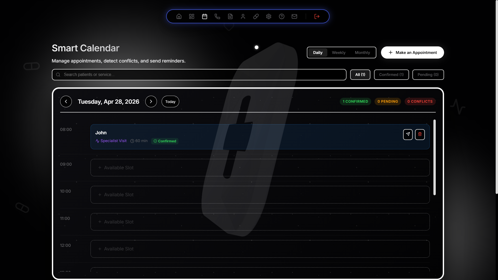<br>
  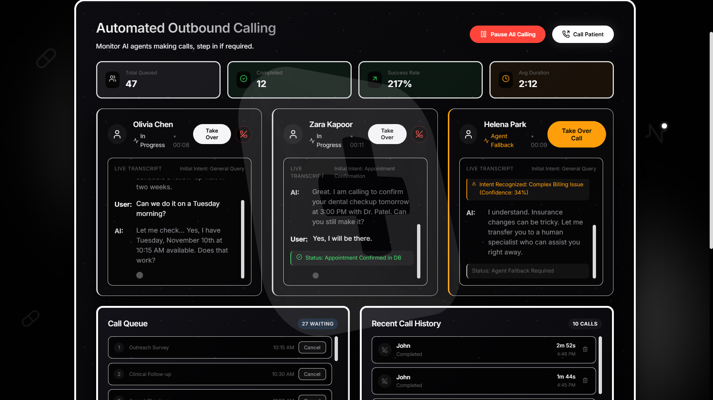<br>
  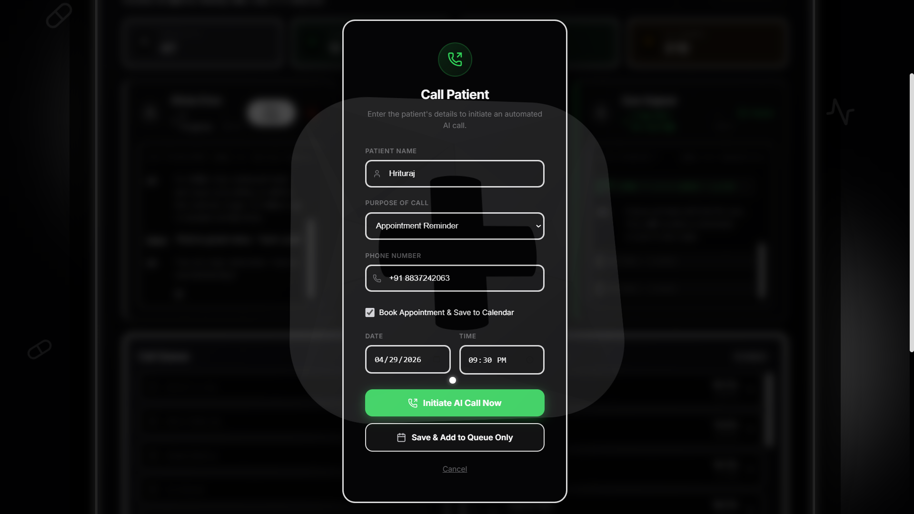<br>
  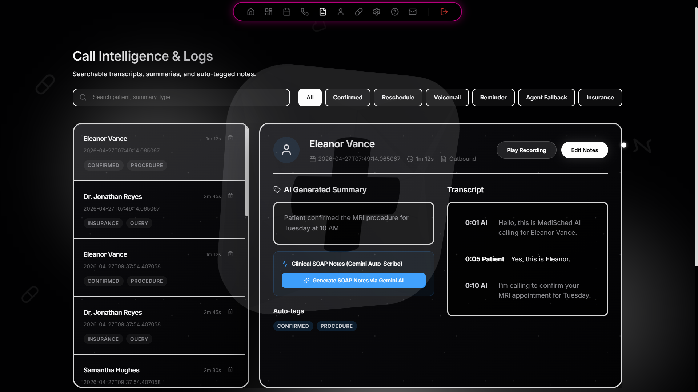<br>
  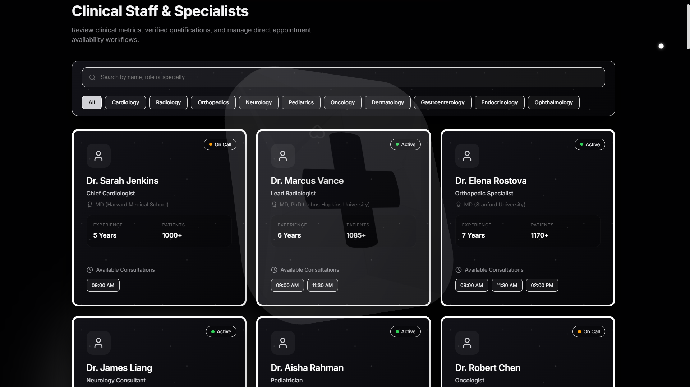<br>
  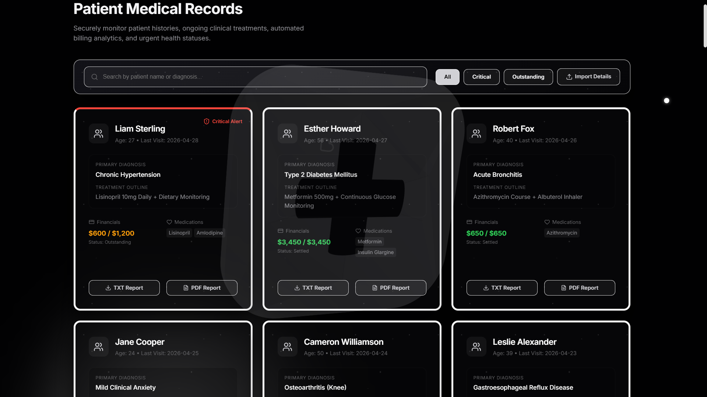<br>
  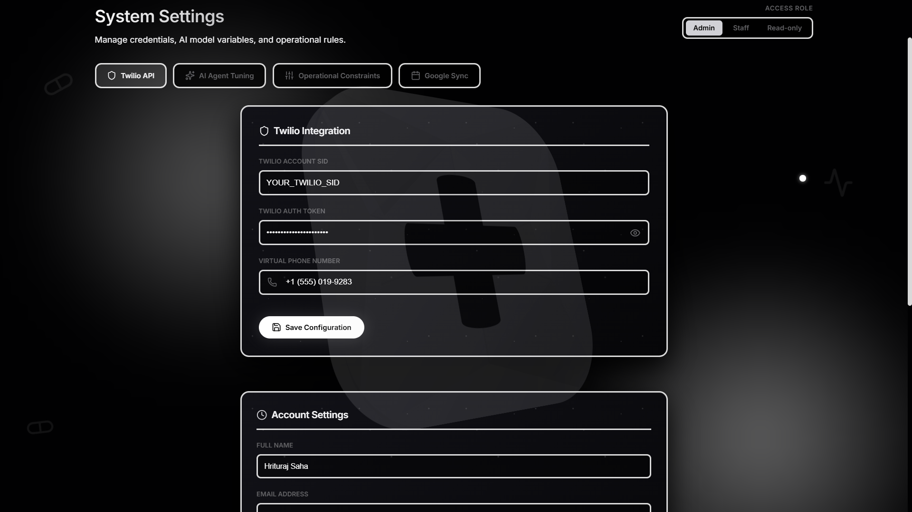<br>
  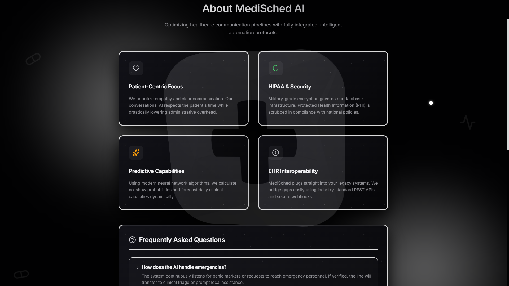<br>
  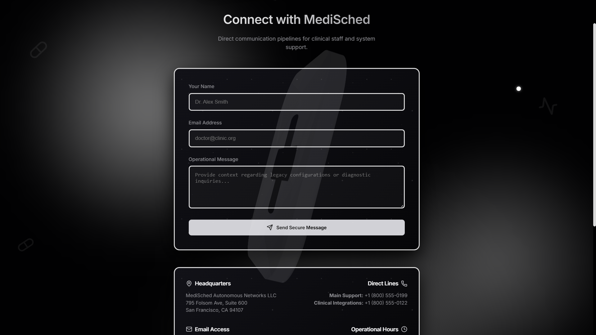<br>
</p>

## 🌟 Key Subsystems & Features
### 📊 1. Intelligent Dashboard & Telemetry
* **Real-Time Synchronization -** Powered by secure WebSockets to stream active queue updates and resource thresholds dynamically.
* **Comprehensive Metrics -** Tracks appointment statistics, success rates, utilization percentages and total active outbound calls using beautiful, responsive Recharts visualizations.

### 📞 2. Automated Calling Outpost
* **Smart Outbound Routing -** Connects administrative teams with patients instantly via the integrated Twilio API subsystem.
* **Simulation Engine -** Includes a modular fallback simulation routing parameter that allows robust development testing without burning live credits.
* **OpenAI Whisper Integration -** Prepared to transcribe outgoing/incoming call metrics and process advanced diagnostic routing efficiently.

### 📅 3. High-Fidelity Calendar & Queue Manager
* **Shift Scheduling -** Allows rapid booking, modification, and conflict assessments for complex medical procedure mappings.
* **Live Backlog Persistence -** Maintains an automated retry configuration mapping against critical medication reviews, vaccine deployments and general lab referrals.

## 🛠️ The Technology Stack
| Layer | Technology Used | Purpose |
|---|---|---|
| **Frontend UI** | Next.js 16 (React 19) | Component-driven dynamic interfaces |
| **Visuals & Motion**| Framer Motion / Lucide | Premium interactive aesthetics & micro-animations |
| **Backend API** | FastAPI (Python) | High-throughput concurrent endpoint routing |
| **Database Engine** | SQLAlchemy & SQLite | Relational table mapping & structured state persistence |
| **Third-Party Nodes**| Twilio Client SDK | Automated VoIP infrastructure integration |

## 💻 Installation & Setup Guide
### Phase A - Backend Infrastructure Setup
1. Ensure you have Python 3.10 or higher installed securely.
2. Navigate into the backend environment -
   ```bash
   cd backend
   ```
3. Create a robust local environment configuration -
   * Generate a new `.env` file mapping -
     ```env
     TWILIO_ACCOUNT_SID=your_sid_here
     TWILIO_AUTH_TOKEN=your_token_here
     TWILIO_PHONE_NUMBER=your_phone_here
     ```
4. Install the Python dependencies -
   ```bash
   pip install -r requirements.txt
   ```
5. Spin up the internal routing node:
   ```bash
   python main.py
   ```

### Phase B - Frontend Deployment
1. Open an isolated command line mapped to the root workspace directory.
2. Install the Next architecture configurations safely -
   ```bash
   npm install
   ```
3. Run the local clinical instance:
   ```bash
   npm run dev
   ```

## 🧠 Architectural Challenges Overcome
* **Asynchronous WebSocket Pipelines -** Guaranteeing minimal UI redraw flickering while processing large relational data calculations efficiently across the active SQLAlchemy bindings.
* **Fallback Simulation Paradigms -** Structuring clean interceptor nodes that cleanly split live production protocols from simulated development scripts gracefully.

## 🗺️ Future Roadmap Milestones
- **Multi-Channel Alerts -** SMS & WhatsApp automated diagnostic delivery thresholds.
- **Predictive Models -** Machine Learning algorithms capable of forecasting patient no-show risk factors securely.
